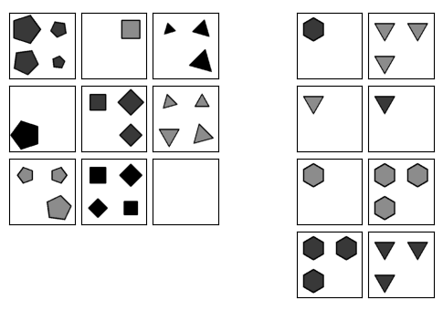
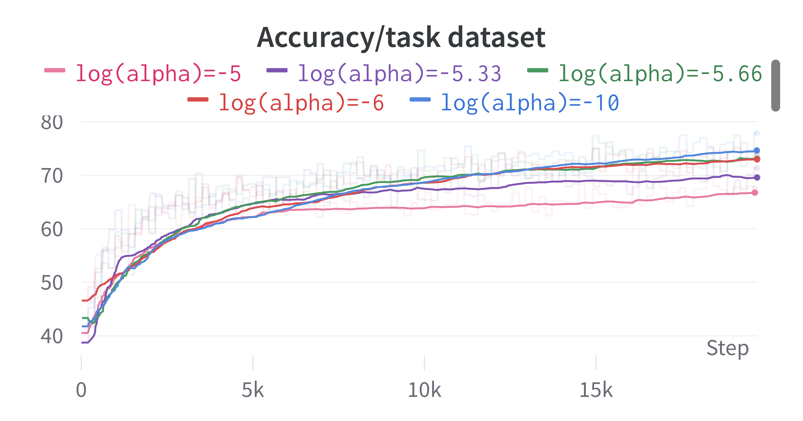
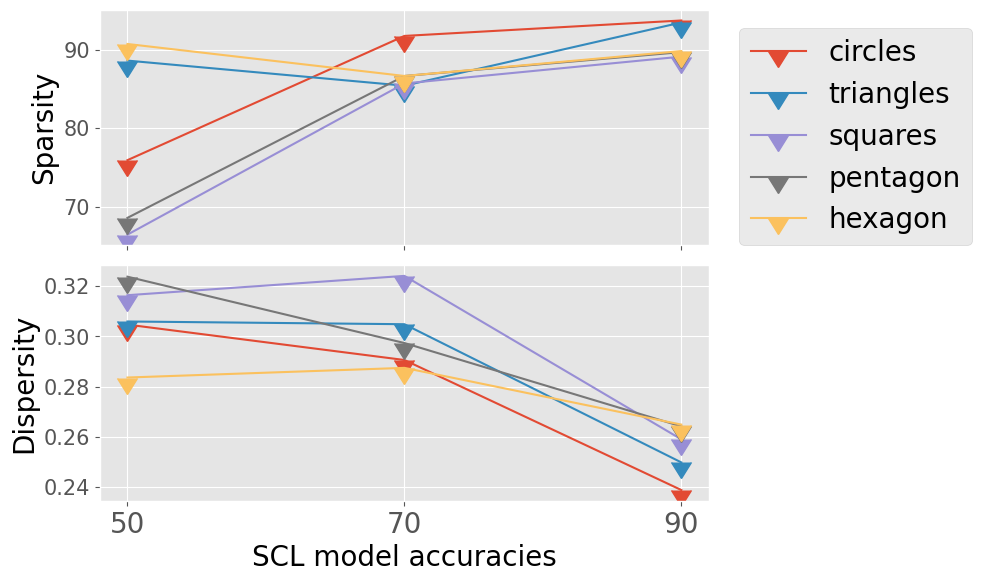
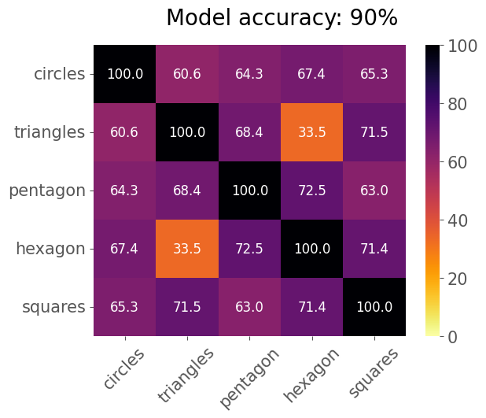

# Tracking Functional Module Development in Abstract Visual Reasoning networks

Description
<br><br>

## Contents
1. [Directory structure](##directory-structure)
2. [Usage](##usage)
3. [Results](##results-overview)

## Directory structure

`binary_masks` - Contains the trained binary masks that identify the functional modules \
`model_ckpts` - Contains weights of SCL at various points during it's training
`models` - Implementation of SCL, and other models used for testing binary masking. \
`data.py` - Classes for loading the abstract visual reasoning datasets \
`mask_analysis.py` - Functions for binary mask analysis \
`SCL_masking.ipynb` - Applies binary weight masking to SCL. \
`masked_layers.py` - Masked layers to build masked models. \
`report.pdf` - Project report and plots \
`SCL_training.ipynb` - Trains SCL model on abstract visual reasoning problems. \
`utils.py` - Utility functions 

## Usage

```python
print('hi')
```


## Results

#### Example AVR problem



An example of an AVR problem. In this study we look to identify groups of weights that are responsible for processing shapes (e.g: circles, squares) *and* track the development of these weights over training. <br><br>


#### Verification of the weight masking algorithm


Verification of the binary weight masking algorithm. Zero-ablating the weights that don't contribute to shape processing does not affect the performance of the model significantly. However, higher values of the regularisation parameter reduce the accuracy that the masked model can attain.
<br><br>

#### Macroscopic module properties over training



We study macroscopic properties of the functional modules, and find that the modules become increasingly sparse and less dispersed over the network as training progresses. See the paper for the definition of sparsity and degree of dispersion ('dispersity')
<br><br>

#### Weight sharing between functional modules



The functional modules identified for each shape share a significant fraction of weights with one another, for the most part. This is to be expected - it's likely that there are functions that underlie the processing of *all* shapes.

