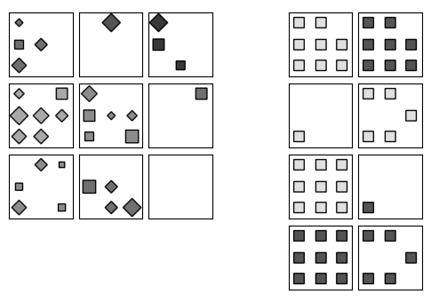

# Tracking Functional Module Development in Abstract Visual Reasoning Networks

Code for dissertation: [Functional Module Development in Abstract Visual Reasoning Networks](https://drive.google.com/file/d/1CHhiasb4b5wZ8tKvAXu-2gEgDP7IO4wj/view?usp=sharing).

I train binary weight masks on abstract visual reasoning (AVR) networks to identify functional modules (specialised groups of weights).

<figure style="text-align: center;">
<div style="display: flex; justify-content: space-between;">
  
  
  
</div>
</figure>

The binary masking process gradually zero-ablates the weights that are not required to execute a task, thereby finding the functional module for that task.

Typical abstract visual reasoning problems contain various shapes ([see here](https://github.com/WellyZhang/RAVEN)). In this work the binary masks are trained on AVR problems with a fixed shape (below), in order to find the functional module responsible for processing that shape. This is repeated at various stages of model training to see how the functional modules *evolve* over training.



The analysis is done for a state-of-the-art AVR network, the [Scattering Compositional Learner](https://arxiv.org/abs/2007.04212). Future work would extend this to other AVR models, and then models trained on date from other modalities. 


## Contents
1. [Directory structure](##directory-structure)
2. [Usage](##usage)
3. [Results](##results-overview)

## Directory structure

`binary_masks` - Contains the trained binary masks that identify the functional modules in SCL. \
`models` - Implementation of SCL and some standard neural network architecture, as well as model checkpoints captured at various stages of SCL's training.  \
`data.py` - Classes for loading the abstract visual reasoning datasets \
`mask_analysis.py` - Functions for binary mask analysis \
`SCL_masking.ipynb` - Applies binary weight masking to SCL. \
`masked_layers.py` - Masked layers and masked models. \
`report` - Project report and plots. \
`SCL_training.ipynb` - Trains SCL model on abstract visual reasoning problems. \
`utils.py` - Utility functions 


## Usage

Install dependencies:
```python
pip install -r requirements.txt
```

Train a model (example for a model with convolutional and regular feed-forward layers): 
```python
model = models.cnn_mlp.CNN_MLP()
for batch_idx,batch in enumerate(train_dataloader):
    ...
    optimiser.step()
```
<br>
A version of the model must then be implemented that allows the binary weight masking to be applied. The `AbstractMaskedModel` class in `masked_layers.py` provides a framework to do this. The key step is to implement the forward pass using the masked layers. An example for the CNN_MLP model above:

```python
class MaskedCNN_MLP(AbstractMaskedModel):
    def __init__(self,kwargs):
        super().__init__(**kwargs)
    def MaskedConvModule(self,x,invert_mask=False):
        x=self.MaskedConv2d(x,name='conv.conv1',invert=invert_mask)
        x=F.relu(self.MaskedBatchNorm2d(x,name='conv.batch_norm1',invert=invert_mask))
        ...
        x=self.MaskedConv2d(x,name='conv.conv4',invert=invert_mask)
        x=F.relu(self.MaskedBatchNorm2d(x,name='conv.batch_norm4',invert=invert_mask))
        x_conv=x.view(x.size()[0],-1)
        return x_conv

    def forward(self,x,invert_mask=False):
        x=self.MaskedConvModule(x,invert_mask=invert_mask)
        x=F.relu(self.MaskedLinear(x,name='l1'))
        x=F.relu(self.MaskedLinear(x,name='l2'))

        return x

masked_model =  MaskedCNN_MLP(model=model)
```

Train masked model:
```python
masked_model.train()
```

Get the binary masks:
```python
binary_masks = masked_model.binaries
```

Tools for analysing the binary masks are provided in `mask_analysis.py`.  

<br>


## Results


#### Verification of the weight masking algorithm


Verification of the binary weight masking algorithm. Zero-ablating the weights that don't contribute to shape processing does not affect the performance of the model significantly. However, higher values of the regularisation parameter reduce the accuracy that the masked model can attain.
<br><br>

#### Macroscopic module properties over training


We study macroscopic properties of the functional modules, and find that the modules become increasingly sparse and less dispersed over the network as training progresses. See the paper for the definition of sparsity and degree of dispersion ('dispersity')
<br><br>

#### Weight sharing between functional modules


The functional modules identified for each shape share a significant fraction of weights with one another, for the most part. This is to be expected - it's likely that there are functions that underlie the processing of *all* shapes.

